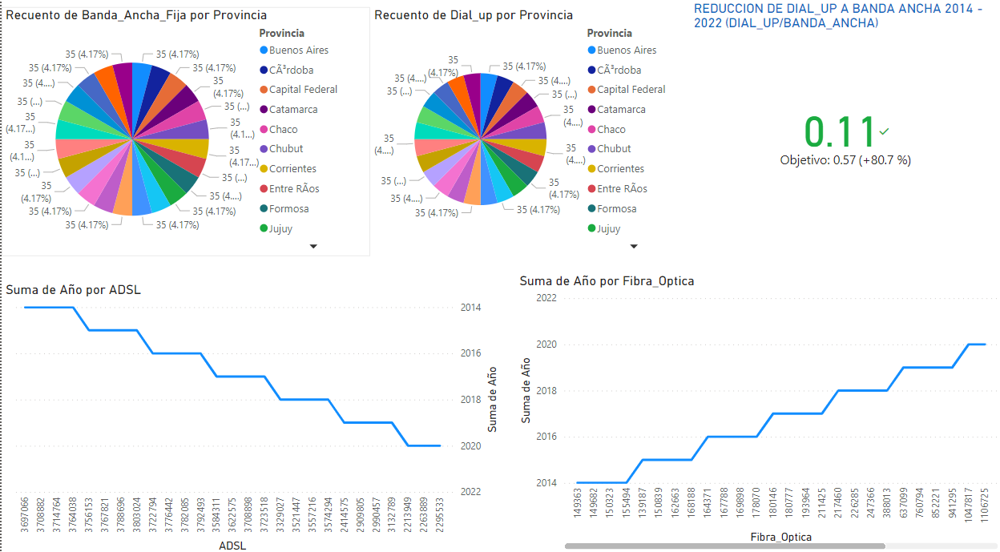
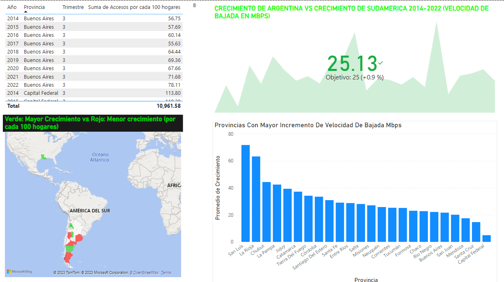
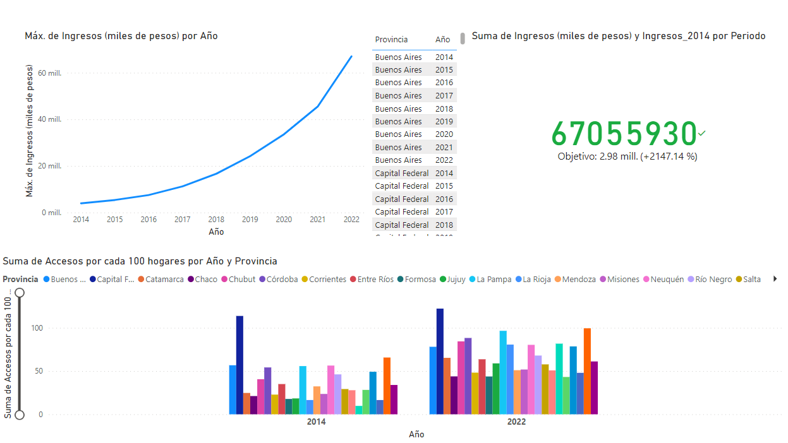

 

# <h1 align=center> **PROYECTO INDIVIDUAL Nº2** </h1>

# <h1 align=center>**`Data Analytics - Comportamiento de Tecnologias de Internet en Argentina - Carlos Vargas'**</h1>

## Te damos la bienvenida a este proyecto enfocado en explorar y analizar datos (EDA) y crear un panel de control en Power BI. Nuestro objetivo principal es realizar un análisis detallado que nos permita comprender el comportamiento del sector de acceso a Internet a nivel nacional.

  

## Problematica :

### En este proyecto, actuamos como Analistas de Datos y nuestro objetivo es guiar a la empresa en la prestación de servicios de calidad, identificar oportunidades de crecimiento y presentar soluciones personalizadas a los clientes potenciales. Nos enfocamos en el análisis de datos para obtener información valiosa que respalde la toma de decisiones estratégicas.

  

## 1)
### **Eleccion e Importacion de Datos** 
### Primero importamos la data desde la pagina gubernamental de Enacom y la trabajamos desde MySQL quitandole las comas que tienen sus columnas numericas para poder hacer operaciones con ellas, y luego haremos una Analisis exploratorio EDA para saber como enfocar nuestra Data

      EDA.ipynb

## 2)
### **Desarrollo de un Dashboard Funcional** 
### Despúes desarrollamos un panel interactivo que presenta los datos de manera coherente y visualmente atractiva. Este panel incluye filtros que permiten explorar los datos en mayor detalle. El diseño del panel ha sido meticulosamente diseñado para facilitar la comprensión e interpretación de la información.

      Dashboard.pbix

## **ANALISIS**

### **1er grupo de Dashboard**

### **2do grupo de Dashboard**
 

### **2do grupo de Dashboard**

## *PREGUNTAS PLANTEADAS*

### 1. ¿Cuáles fueron las provincias argentinas que experimentaron el mayor crecimiento en la adopción de banda ancha de 2014 a 2022? 

### 2. ¿Cuáles fueron las provincias argentinas que tuvieron el menor crecimiento en la adopción de banda ancha en el mismo período? 

### 3. ¿Cuáles fueron las velocidades promedio de conexión a banda ancha en las provincias argentinas durante ese período? 

### 4. ¿Cómo se compara la adopción de banda ancha en Argentina con otros países de Sudamérica? 

### 5. En conclusión, ¿qué se puede inferir sobre la masificación de la banda ancha frente a la conexión dial-up en Argentina de 2014 a 2022? 

## *CONCLUSIONES OBTENIDAS*

### 1.Las provincias de San Luis, La Rioja, Chubut, La Pampa, Jujuy registraron el mayor crecimiento en la adopción de banda ancha durante ese período. 

### 2. Según los datos disponibles, las provincias de Formosa, Catamarca y La Rioja tuvieron el menor crecimiento en la adopción de banda ancha de 2014 a 2022. 

### 3. Las velocidades promedio de conexión a banda ancha en las provincias argentinas variaron, pero en general se observó un aumento significativo. Por ejemplo, en provincias como Buenos Aires, Córdoba y Santa Fe, las velocidades promedio aumentaron de manera considerable.  

### 4. En comparación con otros países de Sudamérica, Argentina ha experimentado un crecimiento mayor al promedio en la adopción de banda ancha. Sin embargo, algunos países vecinos pueden tener tasas de adopción más altas o velocidades promedio más rápidas.
 

### 5. Durante ese período, Argentina ha experimentado un aumento significativo en la adopción de banda ancha, especialmente en provincias como San Luis, La Rioja, Chubut, La Pampa, Jujuy. Esto ha llevado a un incremento en las velocidades promedio de conexión en estas áreas. Si bien aún existen diferencias entre las provincias en términos de crecimiento y velocidades, en general, se puede observar una tendencia positiva hacia la masificación de la banda ancha en el país.

## Glosario

### **Año :**                          <h3 align=center> Fecha entre 2014 a 2022 </h3>
### **ADSL :**                         <h3 align=center>Tecnologia de telefonia con internet desde un mismo cable </h3>
### **Cablemodem :**                   <h3 align=center>Tecnologia de Cable de television con internet </h3>
### **Fibra optica :**                 <h3 align=center>Tecnologia de Internet mediante la conduccion de luz </h3>
### **Wireless :**                     <h3 align=center>Tecnologia de Wireless </h3>
### **Mbps (Meda de bajada) :**        <h3 align=center>Velocidad promedio de bajada en Mbps </h3>
### **Provincia :**                    <h3 align=center>Provincias de Argentina </h3>
### **Accesos por cada 100 hogares :** <h3 align=center>Cantidad de hogares que tienen acceso a conexion a internet </h3>
### **KPI :**                          <h3 align=center>Nos indica si subio o bajo la tasa de 'accesos por cada 100 hogares' </h3>
### **Tasa accesos :**                 <h3 align=center>Tasa porcentual de la columna 'accesos por cada 100 hogares' </h3>
### **Ingresos(en miles de pesos) :**  <h3 align=center>Ingresos generados por la empresa </h3>

